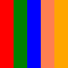

# urLn.github.io
<picture>
<source srcset="svg/bgr.svg" type="image/svg+xml">

</picture>
<picture>
<source srcset="new.svg" type="image/svg+xml">

</picture>
<picture>
<source srcset="svg/base.svg" type="image/svg+xml">

</picture>
