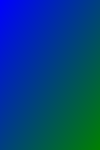

[](https://urln.github.io/svg-circle.html)
#### logo replace with your name
copy this code save to image.svg
```svg
<svg height="24" width="300" xmlns="http://www.w3.org/2000/svg">
<path id="pl1" d="M0 20,q150 0 300 0'" fill="none" stroke="none" stroke-width="10"/>
<text style="
fill: white;
font-size: 26;
stroke: black;
stroke-width: 1;
font-family: cursive;">
<textPath href="#pl1" startOffset="0">
Urln.Github.Io 
<animate attributeName="startOffset" from="300" to="-180" dur="10s" repeatCount="indefinite"/>
</textPath></text></svg>
```


#### background linear gradient svg
<picture>
<source srcset="svg/bgr.svg" type="image/svg+xml">

</picture>

##### this source code from images.svg 
```svg
<svg xmlns='http://www.w3.org/2000/svg' viewBox='0 0 100 150'>
<defs><linearGradient id="gradient1" x1="0%" y1="0%" x2="100%" y2="100%">
<stop offset="0%" style="stop-color: blue; stop-opacity: 1">
<animate attributeName="stop-color" values="blue; green; red; blue" dur="4s" repeatCount="indefinite" /></stop>
<stop offset="100%" style="stop-color: green; stop-opacity: 1">
<animate attributeName="stop-color" values="green; red; blue; green" dur="4s" repeatCount="indefinite" /></stop>
</linearGradient></defs>
<rect x="0" y="0" width="100" height="150" fill="url(#gradient1)" /> 
</svg>
```
##### for insert in body css:
```css
body{
background: url('https://raw.githubusercontent.com/urln/urln/refs/heads/main/svg/bgr.svg');
background-size: cover;
}
```

<picture>
<source srcset="new.svg" type="image/svg+xml">

</picture>
<picture>
<source srcset="svg/base.svg" type="image/svg+xml">

</picture>
